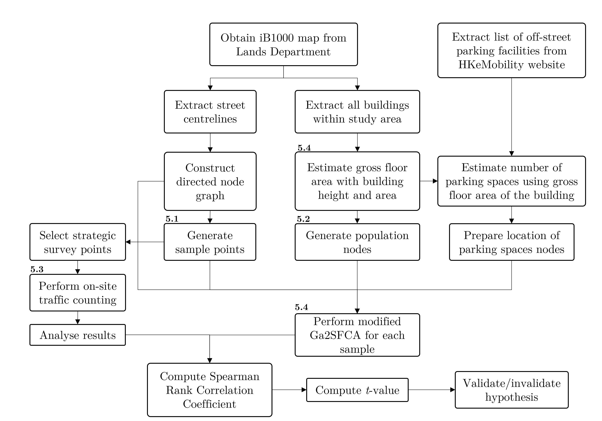

# geo-ee

This repository contains the code for my International Baccalaureate Geography Extended Essay (May 2022 examinations).

The original paper submitted to the IBO and supplementary datasets (to be uploaded soon) are available to download [here](https://doi.org/10.5281/zenodo.6814244), licensed under [CC BY-NC-SA 4.0](https://creativecommons.org/licenses/by-nc-sa/4.0/).

## Abstract
Since the industrialisation of Hong Kong, the territory has observed a shortage in parking supply, resulting from the steady increase in car ownership and the declining growth rate in the number of parking spaces. This investigation focuses on providing a more solid understanding of the relationship between the spatial distribution of parking spaces and the local traffic in urban areas of Hong Kong, through on-site surveys and the Ga2SFCA method, so to build a more resilient and sustainable transport system.

## Technologies
The high-level overview of the methodology is as follows (see Section 5 of the paper for more details):

The OD matrix is first generated using the [QNEAT3](https://github.com/root676/QNEAT3) plugin for [QGIS](https://github.com/qgis/QGIS). This is stored in an sqlite database ([graph/main/db/data.db](graph/main/db/data.db)), which is then accessed by the Ga2SFCA algorithm using [SQLAlchemy](https://github.com/sqlalchemy/sqlalchemy) ([graph/main/db/common.py](graph/main/db/common.py)). The rest of the data processing and analysis is performed using QGIS, Python and Excel.

## uh...

this is what happened when i realised that my 75% done EE is corrupted:

